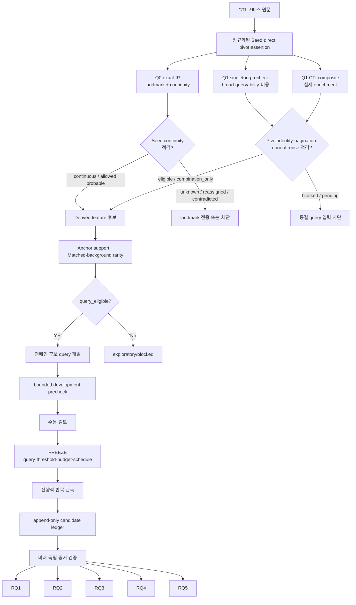
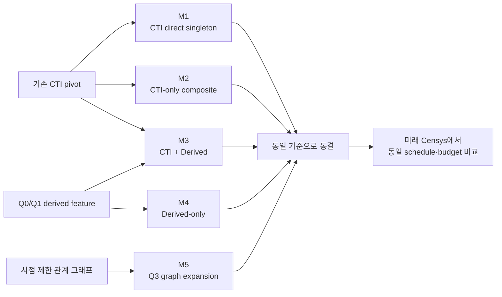
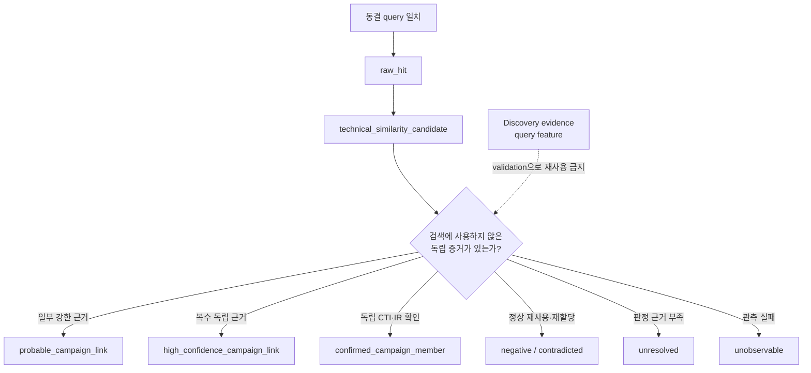
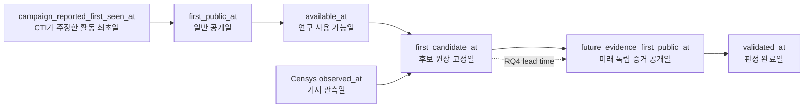
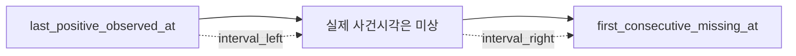
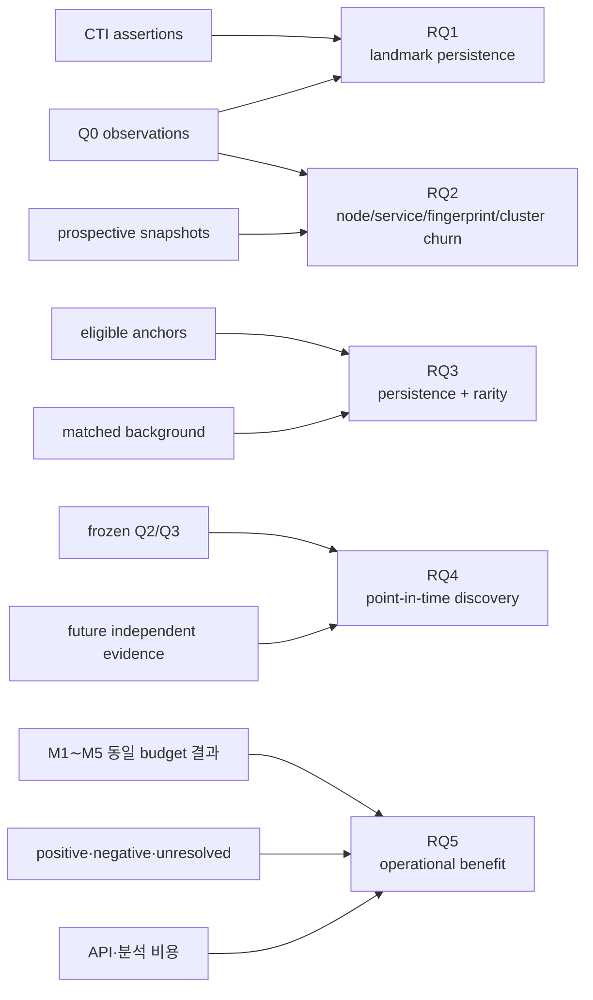
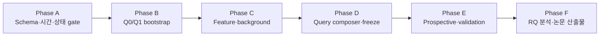

# CTI 기반 Censys 파이프라인 도식

이 문서는 상세 구현 설계도를 빠르게 읽기 위한 시각 자료다. 상세 필드·게이트·테이블 정의는 `2026-07-15-CTI-Censys-파이프라인-구현-설계도.md`를 따른다.

## 1. 한눈에 보는 전체 설계


핵심 흐름은 다음 한 줄로 요약된다.

```text
CTI anchor → Q0/Q1 bootstrap → 신규 특징 → 쿼리 동결 → 미래 후보 → 독립 검증 → RQ별 분석
```

## 2. 단계별 데이터 흐름



## 3. 쿼리 계열



해석:

- M1·M2는 기존 CTI만 사용한 baseline이다.
- M3는 신규 derived feature의 추가효과를 검증하는 주 방법이다.
- M4는 기존 CTI pivot이 변경된 뒤에도 추적 가능한지 평가한다.
- M5는 단일 host 특징이 아니라 관계 그래프를 이용한다.
- Q0 exact-IP는 신규 host 발견 방법이 아니므로 discovery baseline과 분리한다.

## 4. 후보와 독립 검증



가장 중요한 경계는 다음과 같다.

```text
query match ≠ campaign membership
repeated query match ≠ independent validation
unresolved ≠ negative
```

## 5. 날짜 흐름



실제 자료에서는 CTI가 과거 활동을 뒤늦게 공개하거나 연구자가 과거 Censys record를 조회할 수 있다. 따라서 활동·관측 흐름과 공개·지식 흐름을 분리하고, 모든 날짜의 출처·정밀도·하한·상한을 함께 보존한다. 전향 결과에는 별도로 `observed_at >= valid_for_test_from`을 요구한다.

RQ2의 소멸·변경 사건은 다음처럼 처리한다.



마지막 양성 관측일을 소멸일로 확정하지 않는다.

## 6. RQ별 데이터 연결



| RQ | 한 줄 질문 | 핵심 산출물 |
|---|---|---|
| RQ1 | 과거 CTI Seed는 현재 어느 계층에서 관측되는가? | landmark 상태·continuity |
| RQ2 | 미래 관측에서 node·service·fingerprint·cluster는 어떻게 바뀌는가? | interval·churn |
| RQ3 | 어떤 특징이 지속적이고 비교집단에서 희소한가? | persistence·reference-set rarity |
| RQ4 | 동결 query 후보가 미래 독립 증거로 확인되는가? | validation outcome·lead time |
| RQ5 | derived feature가 기존 CTI-only 방법보다 운영상 유용한가? | yield·precision 범위·FP·비용 |

## 7. 구현 순서



구현 우선순위는 `시간·provenance 강제 → Q0/Q1 적격성 → derived feature → query freeze → 미래 수집 → 독립 검증`이다.
